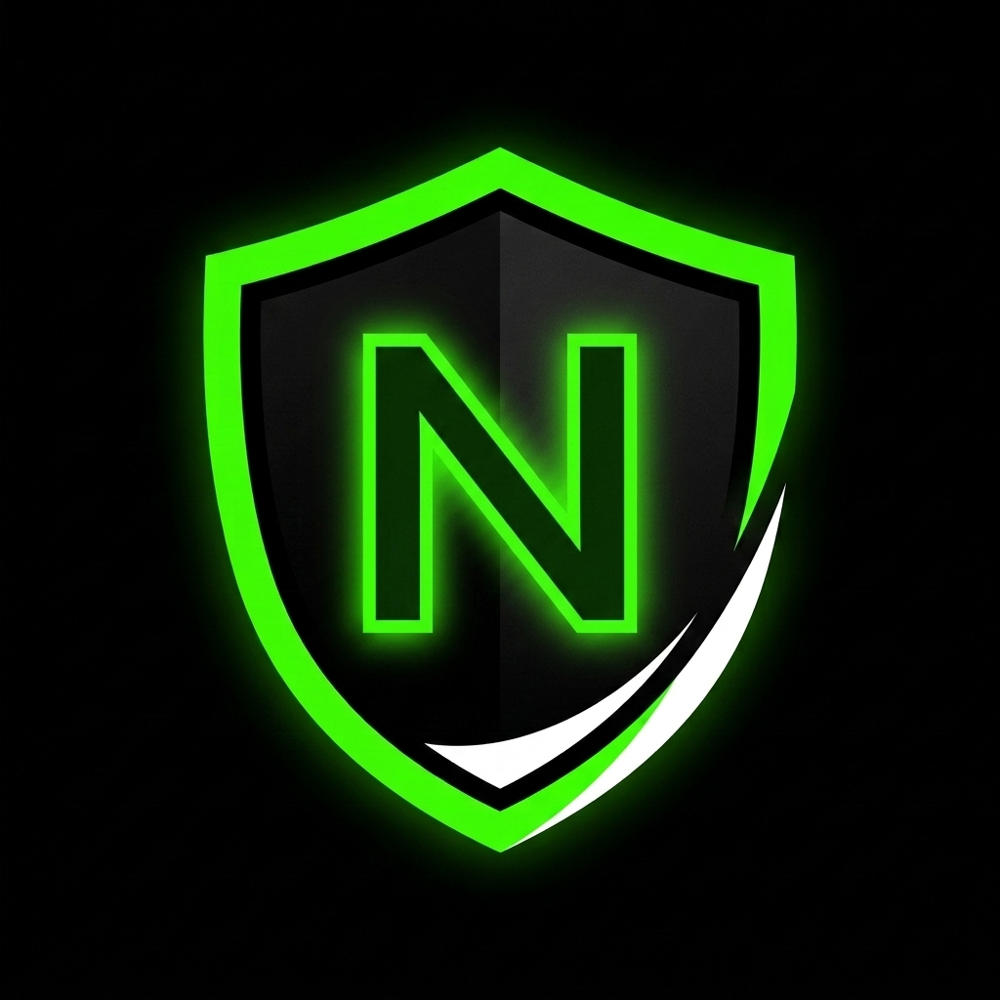

<p align="center">
  <a href="" rel="noopener">
 </a>
</p>

<h3 align="center">NoTrace</h3>

<div align="center">

[](/LICENSE)

</div>

---

<p align="center"> A lightweight, privacy-first Android browser that blocks trackers, minimizes data collection, and puts you in control of your online footprint.
    <br> 
</p>

## 📝 About

NoTrace is a privacy-focused mobile browser designed to put users in control of their online footprint. It provides a secure, minimal browsing experience by routing requests through a custom proxy server that filters out trackers, strips identifiable headers, and enforces a strict no-log policy.

## ✨ Core Features

- **Tracking Protection:** Automatically blocks known trackers and analytics scripts.
- **Request Filtering:** Strips sensitive headers (like Referer and excessive User-Agent details) before they leave the device.
- **Proxy Handling:** Routes traffic through a dedicated backend proxy to mask user IP addresses and location.
- **No-Log Policy:** The backend proxy does not store or log any user requests, IP addresses, or telemetry data.
- **Minimal & Lightweight:** Built for speed with an intuitive user interface and no unnecessary bloat.

## 🏗️ Project Structure

The repository is divided into two main parts:

- `mobile/`: The React Native (Expo) frontend application (the Android browser).
- `server/`: The Node.js/Express backend proxy server handling request filtering and privacy enforcement.

## 💻 Tech Stack

- **Mobile:** React Native, Expo, React Navigation, Axios
- **Server:** Node.js, Express, Helmet, http-proxy-middleware

## 🏁 Getting Started

These instructions will get you a copy of both the frontend and backend running on your local machine for development and testing.

### Prerequisites

- [Node.js](https://nodejs.org/en/) (v18 or higher recommended)
- [npm](https://www.npmjs.com/) or yarn
- Expo CLI for the mobile app

### Server Setup (Backend)

1. Navigate to the server directory:
   ```bash
   cd server
   ```
2. Install dependencies:
   ```bash
   npm install
   ```
3. Start the server (runs on `http://localhost:3000` by default):
   ```bash
   npm start
   ```
   *(For development with auto-reload, use `npm run dev` instead)*

### Mobile Setup (Frontend)

1. Navigate to the mobile directory:
   ```bash
   cd mobile
   ```
2. Install dependencies:
   ```bash
   npm install
   ```
3. Start the Expo development server:
   ```bash
   npm start
   ```
4. Use the Expo Go app on your Android device or an Android emulator to run the app.

## 🎈 Usage

Once both the server and mobile app are running:
1. Open the NoTrace app on your device/emulator.
2. Enter a URL in the address bar (e.g., `https://example.com`) and hit go.
3. The app will fetch the page via the local proxy server, automatically stripping tracking headers and ensuring your IP is not directly exposed to the target website.

## 📜 License

This project is licensed under the MIT License - see the [LICENSE](LICENSE) file for details.
